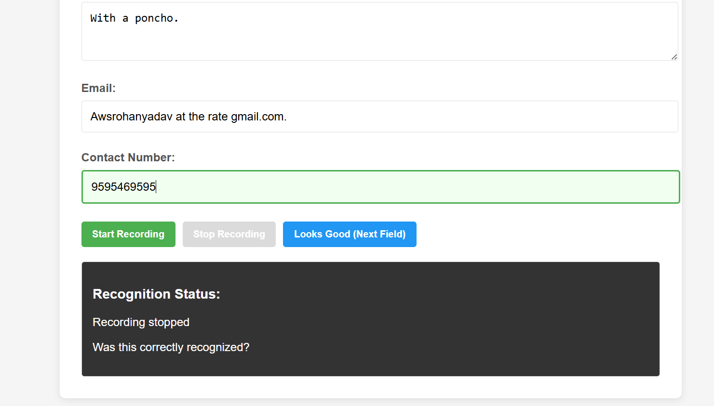

We can use voice recognition to fill forms. 



# Installation 
## Setting Up Your Environment

A simple guide to create an Anaconda environment and install required packages.

### Create and Set Up Environment

```bash
# Create a new conda environment with Python 3.10
conda create -n myenv python=3.10

# Activate the environment
conda activate myenv

# Install packages from requirements.txt
pip install -r requirements.txt
```

### Basic Usage

```bash
# Activate environment when needed
conda activate myenv

# Deactivate when finished
conda deactivate
```

# Downloading speech recognition models

```
mkdir models
cd models
wget https://github.com/k2-fsa/sherpa-onnx/releases/download/asr-models/sherpa-onnx-nemo-parakeet-tdt-0.6b-v2-int8.tar.bz2
tar xvf sherpa-onnx-nemo-parakeet-tdt-0.6b-v2-int8.tar.bz2
rm sherpa-onnx-nemo-parakeet-tdt-0.6b-v2-int8.tar.bz2

wget https://dldata-public.s3.us-east-2.amazonaws.com/2086-149220-0033.wav
mv 2086-149220-0033.wav file.wav
cd ..
```
Finally execute the testing script as 

```
python ./test_model.py \
  --encoder ./models/sherpa-onnx-nemo-parakeet-tdt-0.6b-v2-int8/encoder.int8.onnx \
  --decoder ./models/sherpa-onnx-nemo-parakeet-tdt-0.6b-v2-int8/decoder.int8.onnx \
  --joiner ./models/sherpa-onnx-nemo-parakeet-tdt-0.6b-v2-int8/joiner.int8.onnx \
  --tokens ./models/sherpa-onnx-nemo-parakeet-tdt-0.6b-v2-int8/tokens.txt \
  --wav models/file.wav
```


# Execution

```
python .\asr_server.py --encoder .\models\sherpa-onnx-nemo-parakeet-tdt-0.6b-v2-int8\encoder.int8.onnx --decoder .\models\sherpa-onnx-nemo-parakeet-tdt-0.6b-v2-int8\decoder.int8.onnx  --joiner .\models\sherpa-onnx-nemo-parakeet-tdt-0.6b-v2-int8\joiner.int8.onnx --tokens .\models\sherpa-onnx-nemo-parakeet-tdt-0.6b-v2-int8\tokens.txt --port 8001

```

Now double click `voice-form.html`

# Future Plans

## Make interaction birectional
For now the interaction is only from user to machine. Next is voice from machine to user in order to give feedback to user. So this eliminate all buttons just saying ok next field will work.

## Fine tune the model for more languages
Support more Indian languages other than English.

## Very slow need to run to on cpu.
Quantize the model in order to run on devioces without GPU

# Credits
Thanks to repository which provided server implementation 

https://github.com/KoljaB/RealtimeSTT 

and 

https://github.com/k2-fsa/sherpa-onnx/tree/master

# Coming soon 
1. Support for languages other than english 
2. Voice output after filling the text field 
3. Interaction with only voice such as hey there is an extra r in my name after e or the ee in my name instead of i in my name. 
4. Ability to execute this on tiny devices other than desktop. 
5. Streaming instead of sending .wav files to server.


